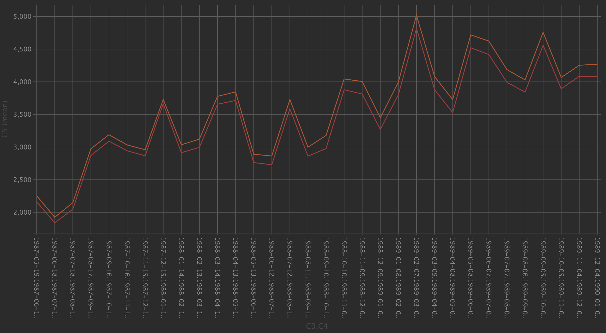

# saer-openapi-sdk

A python sdk for [SAER-OPENAPI](http://api.isaerdata.com/)

## API

* [x] 市场主体数据
    * [x] DSL检索
    * [x] 不同的节点中获取各种不同级别的详情信息
    * [x] 获取联系方式
* [x] 专利数据
    * [x] DSL检索
    * [X] 详情信息接口

## Use

1. Install
    ```shell
    pip install saer-openapi
    ```
2. 引入并初始化:
    ```python
    from saer import Saer
   api = Saer("<client_id>","<client_key>")
    ```
3. DSL检索市场主题数据:
    ```python
    api.all("策勒县路通二手车评估交易有限公司")
    api.detail("新疆数字化交易软件有限公司", "1", "A1")    
    ```
4. DSL检索专利数据:
    ```python
    query_str = "助听器"
    resp = searObj.patent_search(
        {
            "must": [
                {
                    # "children__patent__patname": {"any": ["眼睛"]},
                    # "children__patent__patname": {"any": ["听力仪器", "直插式电感"]}
                    # "children__patent__zqx": {"any": ["眼睛", "直插式电感"]}
                    # "children__patent__gkggr": {"range": ["2023-12-01", "2024-01-30"]}
                    # "children__patent__zflh": {"any": ["A", "B", "C", "D", "E", "F", "G", "H"]}
                }
            ],
            "should": [
                {
                    "children__patent__sqh": {"any": [query_str]},
                    "children__patent__zqx": {"any": [query_str]},
                    "children__patent__patname": {"any": [query_str]},
                    "children__patent__zflh": {"any": [query_str]}
                }
            ]
        },
        {
            "gkggr": {"order": "desc"}
        },
        "2",
        "10",
        v_show=False)
    result = resp.json()["result"]
    print(resp.json()["ordernum"])
    total = result["total"]
    print("Total:", total)
    dataList = result["datalist"]
    for i, data in enumerate(dataList, start=1):
        gkggh = data.get("gkggh")
        gkggr = data.get("gkggr")
        print(i, "/", len(dataList), "|", gkggr, gkggh, data)
    ```
5. 专利详情接口:
    ```python
    api.patent_detail("7c93aaf306ae966dcb2baa13e27d9b6e")
    ```

## 开发计划

* [ ] 控制台日志输出从直接使用`print`改成标准的日志工具库`logging`
* [ ] 开发`saer-cli`控制台Devtool工具

## 接口研究🧐&常见问题反馈

* QueryDSL 中加用IPC分类过滤和不加过滤时的数量区别
    以下DSL其实已经包含了所有IPC大分类 `{"children__patent__zflh": {"any": ["A", "B", "C", "D", "E", "F", "G", "H"]}},`
    但最终还是出现了插曲(如下图所示, 图中橙色线是不加IPC分类过滤,只加公开日期过滤的结果,而红线是加了公开日起和IPC分类过滤的结果)
    